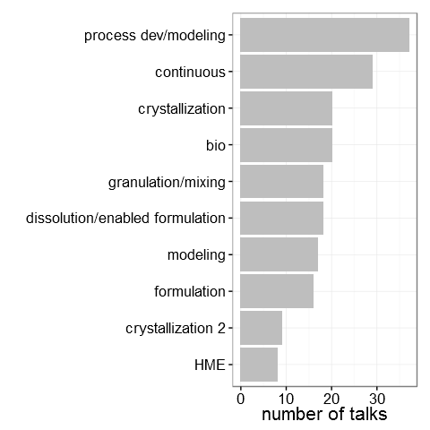
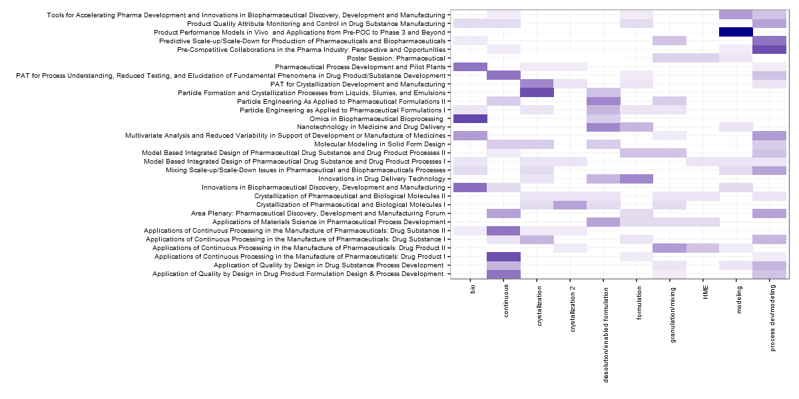
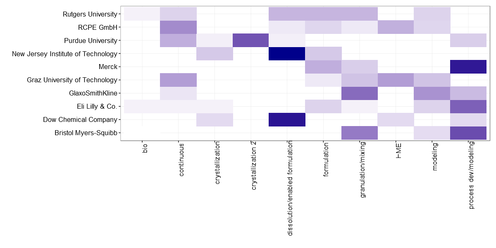

# Exploring AIChE 2015 Technical Program (PD2M topic)

[AIChE](http://www.aiche.org/) (American Institute of Chemical Engineers) holds an [annual meeting](http://www.aiche.org/conferences/aiche-annual-meeting/2015) in November. It has several topical sessions. I wanted to explore the topic session called PD2M (Pharmaceutical Discovery, Development and Manufacturing Forum).  

I wanted to answer the following questions:

* Who are the people giving the largest number of talks?
* Which are the organizations giving the largest number of talks?
* What proportion of talks are authored only by industry, authored by academia only, authored by academia and industry?
* What kind of topics emerge if we use [topicmodels](http://www.cs.columbia.edu/~blei/topicmodeling.html) algorithm on the abstracts of the talks?
* How do these topics relate to sessions?
* How do the topics of interest compare between industry and academia?

*Disclaimer: This is meant to be a fun exercise. It is not meant to be comprehensive and accurate but rather exploratory. So I would suggest not over-interpreting things said here. Take everything said here with a grain of salt.*

## Exploring the data

The PD2M topic has ~30 sessions, ~190 talks in which ~600 authors are presenting and ~115 organizations (industry and academia) are represented. Among organizations, the split between academia and industry is close to 50/50. 

The graph below lists the folks giving at least 4 talks and the number of talks they are giving.    

The graph below lists organizations with least 5 talks and the number of talks from each organization.

About 13% of talks have joint authors from industry and academia, 47% with industry only authors, and 40% with academia only authors  

The graph below shows this split for each session.

The list of talks with both academia and industry authors is [here](acadind.html). Some of the session that are heavy on academic talks are:

* [Nanotechnology in medicine and drug delivery](https://aiche.confex.com/aiche/2015/webprogram/Session30309.html)
* [PAT for crystallization development and manufacturing](https://aiche.confex.com/aiche/2015/webprogram/Session30321.html)
* [Omics in biopharmaceutical bioprocessing](https://aiche.confex.com/aiche/2015/webprogram/Session30548.html)

With sessions on application of continuous manufacturing in drug product ([session I](https://aiche.confex.com/aiche/2015/webprogram/Session30207.html) has more industry talks and [session II](https://aiche.confex.com/aiche/2015/webprogram/Session31416.html) has more talks from academia)

## Themes/Topics across talks

The sessions already represent a categorization of talks. But there are also several text mining algorithms that try to detect themes/topics underlying a set of documents. One of them is [topic models](http://www.cs.columbia.edu/~blei/topicmodeling.html). I wanted to take abstracts of talks as inputs and use topic models to determine underlying topics. We have to specify the number of topics that we want the algorithm to find. The output from the algorithm consists of likely words for each topic and the likelihood of a document containing a topic. We need to assign labels to each topic based on the likely words occuring in the topic. This is subjective. In reality, more than one topic could be covered in one document, but I used the simplistic approach of assigning the topic with highest probability to be the topic that an abstract represents. In this case, I used the [topicmodels](https://cran.r-project.org/web/packages/topicmodels/vignettes/topicmodels.pdf) R package with abstracts of the talks. I chose 10 topics. Also, I just used the functions with default values (I didn't tune any parameters) to get the topics. The figure below shows the top likely words in each of the 10 topics.

Based on the terms, I tentatively assigned the following topic names to each topic:

* 1 - [bio](linkFiles/topictalks1.html)
* 2 - [crystallization](linkFiles/topictalks2.html)
* 3 - [process dev/modeling](linkFiles/topictalks3.html)
* 4 - [HME](linkFiles/topictalks4.html)
* 5 - [crystallization 2](linkFiles/topictalks5.html)
* 6 - [dissolution/enabled formation](linkFiles/topictalks6.html)
* 7 - [formulation](linkFiles/topictalks7.html)
* 8 - [modeling](linkFiles/topictalks8.html)
* 9 - [granulation/mixing](linkFiles/topictalks9.html)
* 10 - [continuous](linkFiles/topictalks10.html)

The number of talks in each topic is given in the figure below. The talks assigned to each topic can be accessed by clicking the links above for each topic. This is good place to put some caveats. As you look at specific talks, there will be several instances where it might seem that the talk doesn't fit in the topic. There are several reasons for that (forcing document to be in one topic, working with default parameters to determine topics, preprocessing prior to running the model). But it seems like even this simple version seems to qualitatively capture the topics even if not exactly for each talk. For the rest of this discussion, I am going to work with these topics assignments inspite of the above said caveats. 

The split of talks in each session across the 10 topics is show in the heat map below (rows sum to 1, more blue implies higher % of session talks in that topic)

A few interesting observations are:

* The session on [product performance models](https://aiche.confex.com/aiche/2015/webprogram/Session30546.html) is very heavy on modeling
* The continous, crystallization, and bio categories seems to correlate reasonably with sessions on continuous processing, crystallization and bio sessions respectively.

The next figure shows the split of talks across topics between industry and academia.

Industry has high focus on process dev/modeling (that's the bread and butter) but academia doesn't have much emphasis in that topic. Academia has higher percentage of talks compared to industry in the areas of crystallization, HME, and continuous.

The next figure shows the split of talks across topics for organizations that have several talks this year.

The academia results are driven by Rutgers University, RCPE GmbH, Graz University, and New Jersey Institute of Technology. HME talks are by RCPE Gmbh, Graz University. Crystallization talks are mainly from Purdue University. Dissolution/Enabled formulation have talks from Dow and New Jersey Institute of Technology.

## Final Thoughts

I don't know if you got something that you didn't already know. I found it useful to see this summary and this was a good learning and fun exercise. Hope you had some fun reading it too. For somebody wanting to reproduce or improve on this, all the code details and links to code are [here](impDetails.html).

