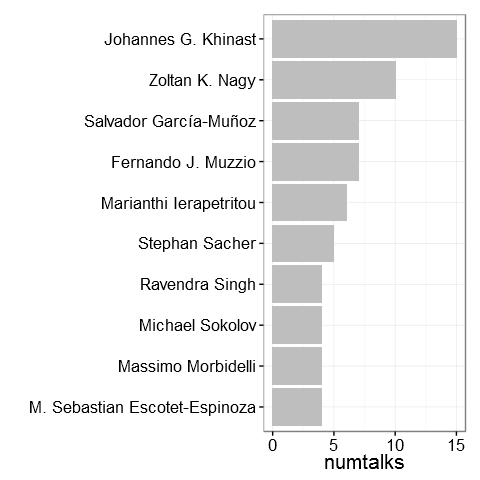
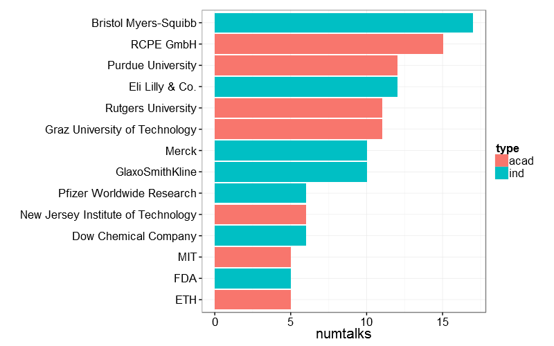
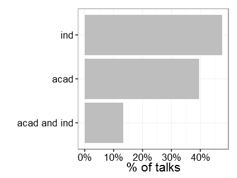
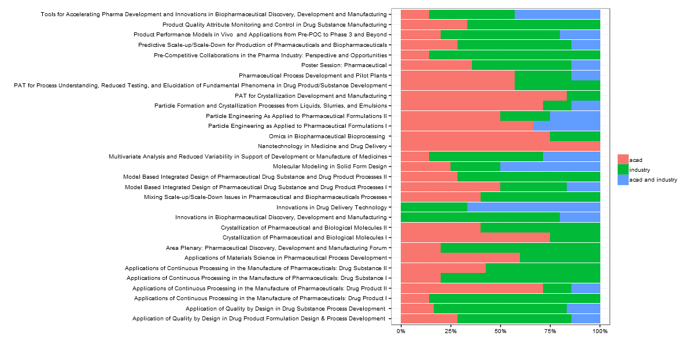

# Exploring AIChE 2015 Technical Program (PD2M topic)

[AIChE](http://www.aiche.org/) (American Institute of Chemical Engineers) holds an [annual meeting](http://www.aiche.org/conferences/aiche-annual-meeting/2015) in November. It has several topical sessions. I wanted to explore the topic session called PD2M (Pharmaceutical Discovery, Development and Manufacturing Forum).  

I wanted to answer the following questions:

* Who are the people giving the largest number of talks?
* Which are the organizations giving the largest number of talks?
* What proportion of talks are authored only by industry, authored by academia only, authored by academia and industry?
* What kind of topics emerge if we use [topicmodels](http://www.cs.columbia.edu/~blei/topicmodeling.html) algorithm on the abstracts of the talks?
* How do these topics relate to sessions?
* How do these topics relate to organizations (do some organizations put more empahsis on one topic vs another)?

*Disclaimer: This is meant to be a fun exercise. It is not meant to be comprehensive and accurate but rather exploratory. So I would suggest not over interpreting things said here. Also, the other part of this was for me to learn some R packages I had only heard of. For folks interested in R, I have listed links to code along the way*

## Getting data (Scraping data from the web)

The first step to this analysis is getting data on the PD2M program (sesssions, talk title, authors, organization, abstract). The [rvest](https://cran.r-project.org/web/packages/rvest/index.html) package in R makes it easy to scrape websites. The code for scraping the data is [here](scrapeData.R). The part which was tricky and required some manual cleaning was extracting organization names. I used the [Standford Named Entity Recognizer](http://nlp.stanford.edu/software/CRF-NER.shtml) through the R package [StanfordCoreNLP](http://datacube.wu.ac.at/) for tagging the organization names and then cleaned up names that were incorrect. 

## Exploring the data

The PD2M topic has ~30 sessions, ~190 talks in which ~600 authors are presenting and ~115 organizations (industry and academia) are represented. Among organizations, the split between academia and industry is close to 50/50. 

The graph below lists the folks giving at least 4 talks and the number of talks they are giving.    

The graph below lists organizations with least 5 talks and the number of talks from each organization.

About 13% of talks have joint authors from industry and academia, 47% with industry only authors, and 40% with academia only authors  

The graph below shows this split for each session.

The list of talks with both academia and industry authors is [here](acadind.Rmd).