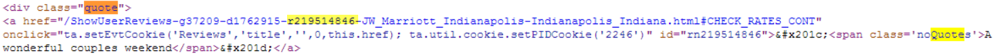

I wanted to explore how to scrape web data using R.I chose to scrape data for hotel reviews from [Trip Advisor](http://www.tripadvisor.com). I show snippets of code below for illustrative purposes. The full code for scraping the data is in the following [location](https://github.com/notesofdabbler/blog_notesofdabbler/blob/master/hotelReview/scrapeTripAdvisor.R).

First I looked up the URL by typing the hotel name in Trip Advisor site. I chose J.W.Marriott in Indianapolis as an example. The main page URL is

<http://www.tripadvisor.com/Hotel_Review-g37209-d1762915-Reviews-JW_Marriott_Indianapolis-Indianapolis_Indiana.html>. 

But the search results span multiple pages. The URL follows the following pattern; for example, page 3 of search results have the URL 

<http://www.tripadvisor.com/Hotel_Review-g37209-d1762915-Reviews-or20-JW_Marriott_Indianapolis-Indianapolis_Indiana.html>.

I scraped data for a hotel by looping through each page. First I extracted the page contents using the following code

```{r, eval=FALSE}
  # get html page content
  doc=htmlTreeParse(urllink,useInternalNodes=TRUE)
```

Then I looked through the source of the page to find the DOM elements/tags that can be used to get a particular hotel review. The id for each hotel appears as part of href:


The set of all such links are extracted:
```{r, eval=FALSE}
  ## get node sets
  # review id
  ns_id=getNodeSet(doc,"//div[@class='quote']/a[@href]") 
```

By similarly looking through page source to see where other elements occur, I used the following code to extract nodes that have information on 

* Top level quote in the review
* partial entry of review shown
* Rating date
* Rating (number of stars)
```{r, eval=FALSE}
  # top quote for a review
  ns_topquote=getNodeSet(doc,"//div[@class='quote']/a[@href]/span") 
  # get partial entry for review that shows in the page
  ns_partialentry=getNodeSet(doc,"//div[@class='col2of2']//p[@class='partial_entry'][1]")
  # date of rating
  ns_ratingdt=getNodeSet(doc,"//div[@class='col2of2']//span[@class='ratingDate relativeDate' or @class='ratingDate']")
  # rating (number of stars)
  ns_rating=getNodeSet(doc,"//div[@class='col2of2']//span[@class='rate sprite-rating_s rating_s']/img[@alt]")
```

The actual content of interest is extracted from node set using two key functions xmlValue and xmlAttrs in XML package.
```{r, eval=FALSE}
  # get actual values extracted from node sets
  # review id
  id=sapply(ns_id,function(x) xmlAttrs(x)["id"])
  # top quote for the review
  topquote=sapply(ns_topquote,function(x) xmlValue(x))
  # rating date (couple of formats seem to be used and hence a and b below)
  ratingdta=sapply(ns_ratingdt,function(x) xmlAttrs(x)["title"])
  ratingdtb=sapply(ns_ratingdt,function(x) xmlValue(x))
  # rating (number of stars)
  rating=sapply(ns_rating,function(x) xmlAttrs(x)["alt"])
  # partial entry for review
  partialentry=sapply(ns_partialentry,function(x) xmlValue(x))
```

To get the full review for a hotel, I clicked on the hotel review. The URL of a specific hotel review has the form (included reviewid in URL):

<http://www.tripadvisor.com/ShowUserReviews-g37209-d1762915-r219794825-JW_Marriott_Indianapolis-Indianapolis_Indiana.html>

I used the following function with each review link to extract the full review. The actual code just involved getting the nodeset and extracting the contents of the node set just like I did above.

```{r, eval=FALSE}
# function to extract full review given review id and full review urllink
getfullrev=function(urllink,id){
  
  # get html content of page containing full review
  docrev=htmlTreeParse(urllink,useInternalNodes=TRUE)
  # extract node set containing full review
  revid=paste("review_",id,sep="")
  qry=paste("//p[@id='",revid,"']",sep="")
  ns_fullrev=getNodeSet(docrev,eval(qry))
  # get full review content
  return(xmlValue(ns_fullrev[[1]]))  
  
}
```
The full code is in the following [location](https://github.com/notesofdabbler/blog_notesofdabbler/blob/master/hotelReview/scrapeTripAdvisor.R). The top 5 records of the dataset created with this code is shown below
```{r, echo=FALSE}
setwd("~/notesofdabbler/blog_notesofdabbler/hotelReview/")
load(file="dfrating_jwmarriott.Rda")
head(dfrating)
```

Next I did some exploratory analysis with this data and is described [here](https://github.com/notesofdabbler/blog_notesofdabbler/blob/master/hotelReview/analyzeTripAdvisor.R).
