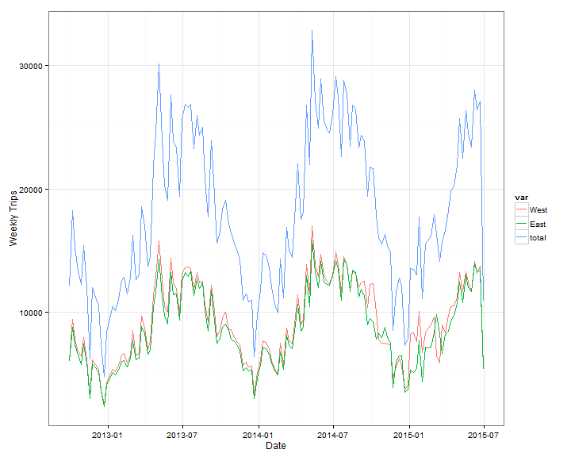
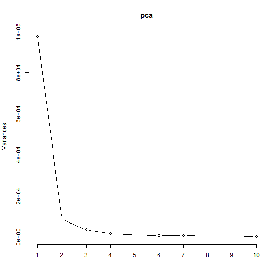
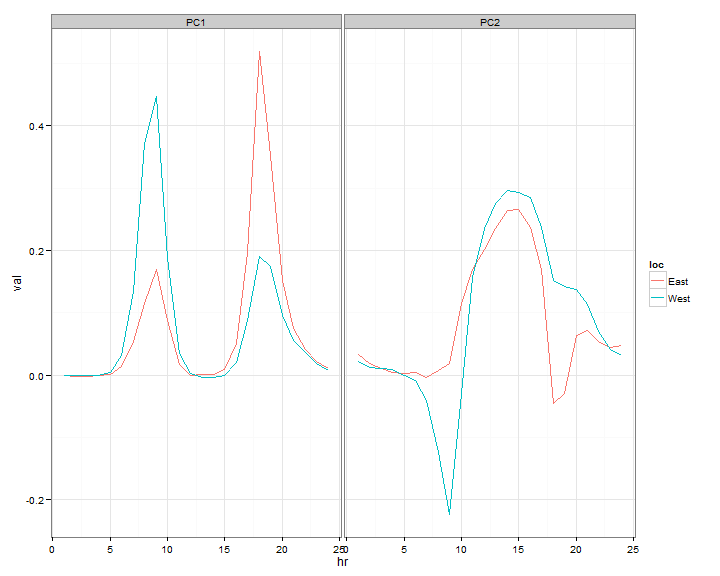
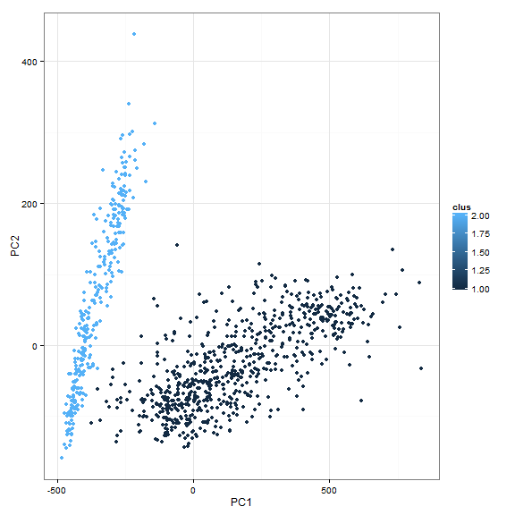
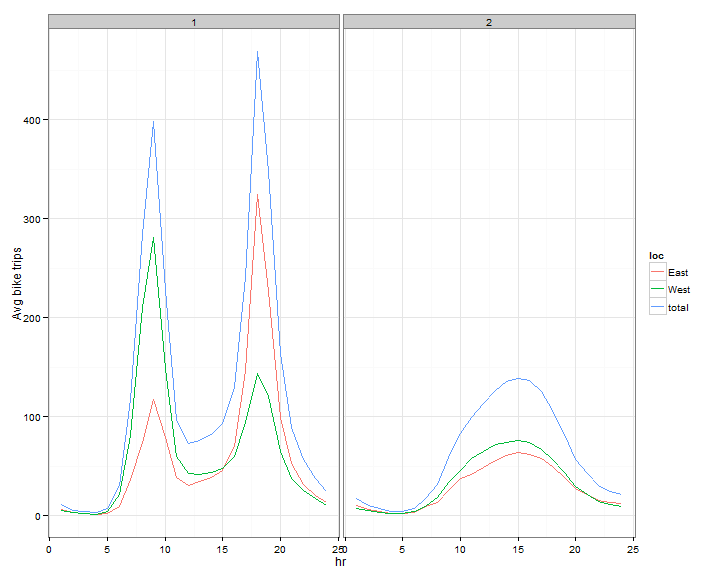
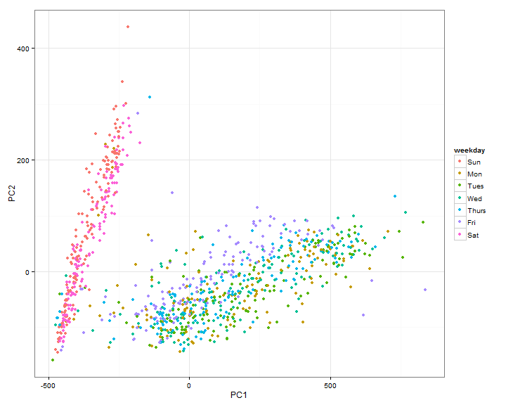

# Seattle's Fremont Bridge Bicyclists Again in the News

Back in 2013, David had done analysis of [bicycle trips](http://www.r-bloggers.com/fun-with-fremont-bridge-bicyclists/) 
across Seattle's Fremont bridge. More recently, [Jake Vanderplas](http://www.astro.washington.edu/users/vanderplas/) (creator of Python's 
very popular [Scikit-learn](http://scikit-learn.org/stable/) package)
wrote a very nice [blog post](https://jakevdp.github.io/blog/2015/07/23/learning-seattles-work-habits-from-bicycle-counts/) on 
Learning Seattle Work habits from bicycle counts across Fremont bridge.

I wanted to work through Jake's analysis using R since I am learning R. Please read the original article by Jake to 
get the full context and thinking behind the analysis. For folks interested in Python, Jake has provided link in the 
blog post to iPython notebook where you can work through the analysis in Python 
(and learn some key Python modules: pandas, matplotlib, sklearn along the way)


```r
# load libraries
library(dplyr) # data munging
```

```
## Warning: package 'dplyr' was built under R version 3.1.2
```

```
## 
## Attaching package: 'dplyr'
## 
## The following object is masked from 'package:stats':
## 
##     filter
## 
## The following objects are masked from 'package:base':
## 
##     intersect, setdiff, setequal, union
```

```r
library(tidyr) # data munging
library(ggplot2) # plotting
library(lubridate) # work with dates
library(mclust) # for clustering using gaussian mixture model
```

```
## Warning: package 'mclust' was built under R version 3.1.3
```

```
##     __  ___________    __  _____________
##    /  |/  / ____/ /   / / / / ___/_  __/
##   / /|_/ / /   / /   / / / /\__ \ / /   
##  / /  / / /___/ /___/ /_/ /___/ // /    
## /_/  /_/\____/_____/\____//____//_/    version 5.0.2
## Type 'citation("mclust")' for citing this R package in publications.
```

```r
library(Cairo) # for getting png outputs
library(rje) # to use cubehelix colors for plots
```

```
## Warning: package 'rje' was built under R version 3.1.3
```

```
## 
## Attaching package: 'rje'
## 
## The following object is masked from 'package:dplyr':
## 
##     last
## 
## The following object is masked from 'package:base':
## 
##     arrayInd
```

```r
library(timeDate) # get list of US holidays
```

```
## Warning: package 'timeDate' was built under R version 3.1.3
```

```
## 
## Attaching package: 'timeDate'
## 
## The following object is masked from 'package:Cairo':
## 
##     Cairo
```

```r
# load data
# 
rawcounts = read.csv("https://data.seattle.gov/api/views/65db-xm6k/rows.csv?accessType=DOWNLOAD")


# inspect data
str(rawcounts)
```

```
## 'data.frame':	24024 obs. of  3 variables:
##  $ Date                        : Factor w/ 24021 levels "01/01/2013 01:00:00 AM",..: 17564 17542 17544 17546 17548 17550 17552 17554 17556 17558 ...
##  $ Fremont.Bridge.West.Sidewalk: int  4 4 1 2 6 21 105 257 291 172 ...
##  $ Fremont.Bridge.East.Sidewalk: int  9 6 1 3 1 10 50 95 146 104 ...
```

```r
head(rawcounts)
```

```
##                     Date Fremont.Bridge.West.Sidewalk
## 1 10/03/2012 12:00:00 AM                            4
## 2 10/03/2012 01:00:00 AM                            4
## 3 10/03/2012 02:00:00 AM                            1
## 4 10/03/2012 03:00:00 AM                            2
## 5 10/03/2012 04:00:00 AM                            6
## 6 10/03/2012 05:00:00 AM                           21
##   Fremont.Bridge.East.Sidewalk
## 1                            9
## 2                            6
## 3                            1
## 4                            3
## 5                            1
## 6                           10
```

```r
# rename columns, set missing values to zero and create a total column (total of east and west)
names(rawcounts) = c("Datetime","West","East")
rawcounts[is.na(rawcounts)] = 0
rawcounts$total = rawcounts$West + rawcounts$East

# Date processing (get date, week, time)
rawcounts$Datetime = as.POSIXct(strptime(rawcounts$Datetime,"%m/%d/%Y %H:%M:%S"))
rawcounts$Date = as.POSIXct(strptime(rawcounts$Datetime,"%Y-%m-%d"))
rawcounts$Time = strftime(rawcounts$Datetime,"%H:%M:%S")
rawcounts$Week = rawcounts$Date - as.difftime(wday(rawcounts$Date)-1,unit = "days")
rawcounts$Weekchr = as.Date(rawcounts$Week)
rawcounts = rawcounts[!is.na(rawcounts$Time),]
rawcounts = rawcounts %>% group_by(Date) %>% mutate(hr = seq(1,length(Date)))

head(rawcounts)
```

```
## Source: local data frame [6 x 9]
## Groups: Date
## 
##              Datetime West East total       Date     Time       Week
## 1 2012-10-03 12:00:00    4    9    13 2012-10-03 12:00:00 2012-09-30
## 2 2012-10-03 01:00:00    4    6    10 2012-10-03 01:00:00 2012-09-30
## 3 2012-10-03 02:00:00    1    1     2 2012-10-03 02:00:00 2012-09-30
## 4 2012-10-03 03:00:00    2    3     5 2012-10-03 03:00:00 2012-09-30
## 5 2012-10-03 04:00:00    6    1     7 2012-10-03 04:00:00 2012-09-30
## 6 2012-10-03 05:00:00   21   10    31 2012-10-03 05:00:00 2012-09-30
## Variables not shown: Weekchr (date), hr (int)
```

## Weekly Trend of Bicycle Counts


```r
# sum by week and plot trend
# In Python with Pandas in Jake's post, from data set to this plot was a single line of code 
# some of the things I am doing on date processing might have better ways to code
rawcounts_wk = rawcounts %>% group_by(Weekchr) %>% summarize(West = sum(West), East = sum(East), total = sum(total))
rawcounts_wk$Week = as.Date(rawcounts_wk$Weekchr)
rawcounts_wk2 = gather(rawcounts_wk,var,val,-Week,-Weekchr)
```

```r
#CairoPNG("bikecounts_wk.png",width = 600, height = 480)
ggplot(rawcounts_wk2) + geom_line(aes(x = Week,y = val,color = var)) + xlab("Date") + ylab("Weekly Trips") + theme_bw()
```

 

```r
#dev.off()
```

## Principal Component Analysis of Data


```r
# spread data so that each row is a day and columns are bike trips for each hr (24 points) both for east and west side
rawcounts_gloc = gather(rawcounts,loc,val,East,West)
rawcounts_gloc$key = paste(rawcounts_gloc$loc,rawcounts_gloc$hr,sep = "_")
rawcounts_gloc = rawcounts_gloc %>% select(Date,key,val)
rawcounts_day = spread(rawcounts_gloc,key,val)

nameorder = c("Date",paste0("East_",seq(1,24)),paste0("West_",seq(1,24)))
rawcounts_day = rawcounts_day[,nameorder]

head(rawcounts_day)
```

```
## Source: local data frame [6 x 49]
## 
##         Date East_1 East_2 East_3 East_4 East_5 East_6 East_7 East_8
## 1 2012-10-03      9      6      1      3      1     10     50     95
## 2 2012-10-04     11      0      6      3      1     11     51     89
## 3 2012-10-05      7      4      3      2      2      7     37    101
## 4 2012-10-06      7      5      2      2      1      2     15     16
## 5 2012-10-07      5      5      1      2      2      3      8     12
## 6 2012-10-08      5      2      0      4      2      7     48     94
## Variables not shown: East_9 (dbl), East_10 (dbl), East_11 (dbl), East_12
##   (dbl), East_13 (dbl), East_14 (dbl), East_15 (dbl), East_16 (dbl),
##   East_17 (dbl), East_18 (dbl), East_19 (dbl), East_20 (dbl), East_21
##   (dbl), East_22 (dbl), East_23 (dbl), East_24 (dbl), West_1 (dbl), West_2
##   (dbl), West_3 (dbl), West_4 (dbl), West_5 (dbl), West_6 (dbl), West_7
##   (dbl), West_8 (dbl), West_9 (dbl), West_10 (dbl), West_11 (dbl), West_12
##   (dbl), West_13 (dbl), West_14 (dbl), West_15 (dbl), West_16 (dbl),
##   West_17 (dbl), West_18 (dbl), West_19 (dbl), West_20 (dbl), West_21
##   (dbl), West_22 (dbl), West_23 (dbl), West_24 (dbl)
```

```r
dim(rawcounts_day)
```

```
## [1] 1001   49
```

```r
# Principal component analysis of the data where each row is a day and data for each day is the 24 hr bike counts on the
# east and west side
# X is the numeric marix of bike counts for each day
X = rawcounts_day[,2:ncol(rawcounts_day)]
X = as.matrix(X)
X[is.na(X)] = 0
pca = prcomp(X)

# Summary of the PCA
summary(pca)
```

```
## Importance of components:
##                             PC1      PC2      PC3      PC4     PC5     PC6
## Standard deviation     312.3645 93.56418 58.57361 39.16813 31.4130 26.7585
## Proportion of Variance   0.8311  0.07456  0.02922  0.01307  0.0084  0.0061
## Cumulative Proportion    0.8311  0.90563  0.93485  0.94792  0.9563  0.9624
##                             PC7      PC8      PC9     PC10     PC11
## Standard deviation     24.66786 20.94137 18.95486 17.73606 15.41720
## Proportion of Variance  0.00518  0.00374  0.00306  0.00268  0.00202
## Cumulative Proportion   0.96760  0.97134  0.97440  0.97708  0.97910
##                            PC12     PC13     PC14    PC15     PC16
## Standard deviation     14.76303 13.82645 12.99149 12.3328 11.69283
## Proportion of Variance  0.00186  0.00163  0.00144  0.0013  0.00116
## Cumulative Proportion   0.98096  0.98259  0.98403  0.9853  0.98649
##                            PC17     PC18     PC19     PC20    PC21    PC22
## Standard deviation     11.21889 11.21146 10.74584 10.09131 9.82031 9.63307
## Proportion of Variance  0.00107  0.00107  0.00098  0.00087 0.00082 0.00079
## Cumulative Proportion   0.98756  0.98863  0.98961  0.99048 0.99130 0.99209
##                           PC23    PC24    PC25    PC26    PC27    PC28
## Standard deviation     9.55682 9.39928 9.17975 8.78637 8.47197 8.34803
## Proportion of Variance 0.00078 0.00075 0.00072 0.00066 0.00061 0.00059
## Cumulative Proportion  0.99287 0.99362 0.99434 0.99500 0.99561 0.99620
##                           PC29    PC30    PC31    PC32    PC33    PC34
## Standard deviation     7.95847 7.51650 6.73965 6.42615 5.88159 5.54950
## Proportion of Variance 0.00054 0.00048 0.00039 0.00035 0.00029 0.00026
## Cumulative Proportion  0.99674 0.99722 0.99761 0.99796 0.99826 0.99852
##                           PC35    PC36    PC37    PC38    PC39    PC40
## Standard deviation     5.03446 4.91174 4.52490 4.34121 4.22342 4.19869
## Proportion of Variance 0.00022 0.00021 0.00017 0.00016 0.00015 0.00015
## Cumulative Proportion  0.99873 0.99894 0.99911 0.99927 0.99943 0.99958
##                           PC41    PC42    PC43    PC44    PC45    PC46
## Standard deviation     3.68183 3.06970 2.52526 2.50865 2.27640 1.95388
## Proportion of Variance 0.00012 0.00008 0.00005 0.00005 0.00004 0.00003
## Cumulative Proportion  0.99969 0.99977 0.99983 0.99988 0.99992 0.99996
##                           PC47    PC48
## Standard deviation     1.82709 1.35111
## Proportion of Variance 0.00003 0.00002
## Cumulative Proportion  0.99998 1.00000
```

```r
screeplot(pca,type = "lines")
```

 

```r
# First two PC's are kept as in Jake's post (they account for 90% of the variance)
scores = data.frame(pca$x[,1:2])

# The scores are plotted on a 2D plot and each point (day) is colored based on total number of trips that day

scores$tottrips = apply(X,1,sum)

ggplot(data = scores,aes(x = PC1,y = PC2,color = tottrips)) + geom_point()
```

 

```r
# the color scheme in the plot in Jake's post (cubehelix) seems much nicer. 
# But since I wasn't sure how to use it with continuous scale, I discretized total trips into buckets
# and applied that color scheme
#CairoPNG("pcScores.png",height = 600, width = 600)
ggplot(data = scores,aes(x = PC1,y = PC2,color = cut(tottrips,7))) + geom_point() + 
  scale_color_manual(name = "total trips", values = cubeHelix(7)) 
```

 

```r
#dev.off()

# In Jake's post, there was not much discussion on loadings. Some of the subsequent inferences done using clustering can be found
# from the loadings of the first 2 principal components also (at least in this case)
loadings = as.data.frame(pca$rotation[,1:2])
loadings$label = row.names(loadings)
loadings$loc = sapply(loadings$label,function(x) strsplit(x,"_")[[1]][1])
loadings$hr = rep(seq(1,24),2)

head(loadings)
```

```
##                  PC1         PC2  label  loc hr
## East_1 -6.142215e-04 0.033744200 East_1 East  1
## East_2 -1.467708e-03 0.018527664 East_2 East  2
## East_3 -1.399792e-03 0.010761605 East_3 East  3
## East_4  7.510103e-05 0.003641056 East_4 East  4
## East_5  1.847658e-03 0.003452151 East_5 East  5
## East_6  1.434066e-02 0.004614364 East_6 East  6
```

```r
loadings_gpc = gather(loadings,pc,val,PC1,PC2)
```

```r
# the loadings plot below also shows what the clustering later shows that PC1 is about weekday bike riding patterns
# and PC2 is about holiday bike riding patters
# PC1 also shows what clustering shows later that West side peaks in the morning and East side peaks in the evening,
#CairoPNG("pcLoadings.png",height = 600, width = 800)
ggplot(data = loadings_gpc) + geom_line(aes(x = hr, y = val, color = loc)) + facet_grid(~pc,scales = "free_y") + theme_bw()
```

 

```r
#dev.off()
```

## Clustering


```r
# clustering: Gaussian mixture model clustering done with two PC scores as in Jake's post
#
fitclus = Mclust(scores[,c("PC1","PC2")],G = 2)

# append cluster information to scores data
scores$clus = fitclus$classification

# plot first 2 PC scores and color by cluster (the clustering in this case picks the two clusters seen visually)
ggplot(data = scores,aes(x = PC1,y = PC2,color = clus)) + geom_point() + theme_bw()
```

 

```r
# append cluster information to the original data used for PCA (day x hr data set)
rawcounts_day$clus = scores$clus

# merge cluster info back to original data
rawcounts_wclus = inner_join(rawcounts,rawcounts_day[,c("Date","clus")],by = "Date")

# get the average number of bike rides for each cluster
rawcounts_wclus_gloc = gather(rawcounts_wclus[,c("Date","East","West","total","hr","clus")],loc,val,East,West,total)
rawcounts_clusavg = rawcounts_wclus_gloc %>% group_by(clus,loc,hr) %>% summarize(val = mean(val))
```

```r
#
# This type of graph was used in the original post to show the difference in trend between two clusters
# that led next to investigating the day of week in each cluster
#
#CairoPNG("clusterAvg.png",height = 600, width = 800)
ggplot(data = rawcounts_clusavg) + geom_line(aes(x = hr,y = val,color = loc)) + facet_grid(~clus) + 
  ylab("Avg bike trips") + theme_bw()
```

 

```r
#dev.off()

# get weekday for each date
scores$weekday = wday(rawcounts_day$Date,label = TRUE)

# plot 2 PC scores and color them by day of week
# This plot gives interpretation to the clusters as weekday cluster (1) and weekend cluster (2)
#CairoPNG("scoresbyWkday.png",height = 600, width = 600)
ggplot(data = scores,aes(x = PC1,y = PC2,color = weekday)) + geom_point() + theme_bw()
```

 

```r
#dev.off()


# Next the few weekdays that fall with weekend cluster were investigated
oddWkdays = data.frame(Date = rawcounts_day$Date,clus = scores$clus,weekday = scores$weekday)
oddWkdays = oddWkdays %>% filter(clus == 2,!(weekday %in% c("Sat","Sun")))
oddWkdays$Date = as.Date(oddWkdays$Date)

head(oddWkdays)
```

```
##         Date clus weekday
## 1 2012-11-22    2   Thurs
## 2 2012-11-23    2     Fri
## 3 2012-12-24    2     Mon
## 4 2012-12-25    2    Tues
## 5 2013-01-01    2    Tues
## 6 2013-05-27    2     Mon
```

```r
# Get master holiday list (names) and associated dates in year 2012-2015
mstrHolidayList = expand.grid(year = 2012:2015,holidayName = as.character(listHolidays("US")),stringsAsFactors = FALSE)
HolidayDates = lapply(1:nrow(mstrHolidayList),function(x) holiday(year = mstrHolidayList$year[x], Holiday = mstrHolidayList$holidayName[x])@Data)
mstrHolidayList$Date = do.call("c",lapply(HolidayDates,function(x) as.Date(x)))

# add day before and day after
mstrHolidayList_plusOne = data.frame(year = mstrHolidayList$year, Date = mstrHolidayList$Date + 1, 
                                     holidayName = paste0("day after ",mstrHolidayList$holidayName))
mstrHolidayList_minusOne = data.frame(year = mstrHolidayList$year, Date = mstrHolidayList$Date - 1, 
                                     holidayName = paste0("day before ",mstrHolidayList$holidayName))

mstrHolidayList = bind_rows(mstrHolidayList,mstrHolidayList_plusOne,mstrHolidayList_minusOne)

# check how many of the odd week days that fall in cluster 2 are holidays
chkoddWkdays = (oddWkdays$Date %in% mstrHolidayList$Date)
# The total below is zero indicating that all of the odd Week days are US holidays
sum(chkoddWkdays == FALSE)
```

```
## [1] 0
```

```r
# list of holiday names
oddWkdaysname = mstrHolidayList$holidayName[match(oddWkdays$Date,mstrHolidayList$Date)]
oddWkdaysname = unique(gsub("(day before |day after )","",oddWkdaysname))
# these are holidays when people didn't go to work
oddWkdaysname
```

```
## [1] "USThanksgivingDay" "USChristmasDay"    "USNewYearsDay"    
## [4] "USMemorialDay"     "USIndependenceDay" "USLaborDay"
```

```r
# US holidays which did not fall in the odd cluster (i.e. people went to work)
holidayNames =  mstrHolidayList$holidayName
holidayNames =  unique(gsub("(day before |day after )","",holidayNames))

# these are holidays when people went to work
workingHolidays = holidayNames[!(holidayNames %in% oddWkdaysname)]
workingHolidays
```

```
##  [1] "USColumbusDay"           "USCPulaskisBirthday"    
##  [3] "USDecorationMemorialDay" "USElectionDay"          
##  [5] "USGoodFriday"            "USInaugurationDay"      
##  [7] "USLincolnsBirthday"      "USMLKingsBirthday"      
##  [9] "USPresidentsDay"         "USVeteransDay"          
## [11] "USWashingtonsBirthday"
```

Thanks again to [Jake Vanderplas](http://www.astro.washington.edu/users/vanderplas/) for a nice analysis and illustrating how lot 
lot of insights can be gathered from data.

## Session Info
This analysis was done in RStudio v0.99.465


```r
sessionInfo()
```

```
## R version 3.1.1 (2014-07-10)
## Platform: x86_64-w64-mingw32/x64 (64-bit)
## 
## locale:
## [1] LC_COLLATE=English_United States.1252 
## [2] LC_CTYPE=English_United States.1252   
## [3] LC_MONETARY=English_United States.1252
## [4] LC_NUMERIC=C                          
## [5] LC_TIME=English_United States.1252    
## 
## attached base packages:
## [1] stats     graphics  grDevices utils     datasets  methods   base     
## 
## other attached packages:
## [1] timeDate_3012.100 rje_1.9           Cairo_1.5-6       mclust_5.0.2     
## [5] lubridate_1.3.3   ggplot2_1.0.0     tidyr_0.1         dplyr_0.4.1      
## [9] knitr_1.8        
## 
## loaded via a namespace (and not attached):
##  [1] assertthat_0.1   colorspace_1.2-4 DBI_0.3.1        digest_0.6.4    
##  [5] evaluate_0.5.5   formatR_1.0      grid_3.1.1       gtable_0.1.2    
##  [9] labeling_0.3     lazyeval_0.1.10  magrittr_1.0.1   MASS_7.3-33     
## [13] memoise_0.2.1    munsell_0.4.2    parallel_3.1.1   plyr_1.8.1      
## [17] proto_0.3-10     Rcpp_0.11.6      reshape2_1.4     scales_0.2.4    
## [21] stringr_0.6.2    tools_3.1.1
```

